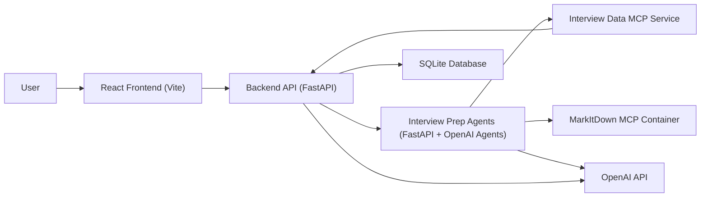

# Interview Simulator App

Interview Simulator App is an AI-powered practice platform for job candidates who want to rehearse interviews against a specific CV and job description. The application lets a user create an account, upload or paste their documents, run a guided mock interview, and receive a scored feedback report with strengths, weaknesses, and per-question coaching.

The project is orchestrated with .NET Aspire and is composed of a React frontend plus several FastAPI services. The recommended way to run everything locally is through the root `apphost.cs` file, which wires the services together automatically.

## Useful links
- [Landing page](https://interview-coach-beta.vercel.app/)
- [Business foundation](docs/BusinessFoundation.pdf)
- [Pitch for funding](docs/Pitch.pdf)

## What the Application Does

- Creates and manages user accounts with login, logout, and session persistence.
- Accepts CV and job description content either as pasted text or uploaded files.
- Parses uploaded `.pdf`, `.doc`, `.docx`, `.txt`, `.md`, and `.html` files into plain text.
- Runs a question-by-question mock interview flow.
- Offers on-demand hints and model answers during an interview.
- Generates a final interview report with an overall score, strengths, improvement areas, behavioral feedback, technical feedback, communication feedback, and per-question feedback.
- Stores interview history so users can revisit past sessions and track improvement.

## Architecture



## Main Services

### Frontend

Located in `src/frontend`.

- React 19 + TypeScript + Vite
- Handles authentication, interview setup, interview execution, history, and summary pages
- Proxies `/api` requests to the backend during development

### Backend API

Located in `src/backend`.

- FastAPI service that acts as the main application backend
- Owns authentication, interview persistence, document parsing requests, interview session lifecycle, and final scoring/report orchestration
- Uses SQLite for local persistence
- Calls the agent service for AI-generated plans, hints, model answers, and reports

### Interview Prep Agents

Located in `src/interview-prep-agents`.

- FastAPI service built around the OpenAI Agents SDK
- Generates interview questions, reports, hints, and model answers
- Integrates with MCP services used by the interview workflow

### Interview Data MCP

Located in `src/interview-data-mcp`.

- FastAPI + MCP server
- Exposes interview session data from the SQLite database as MCP tools for the agent workflow

### MarkItDown MCP Container

Provisioned by the Aspire app host from a docker image based on [this repository](https://github.com/microsoft/markitdown/tree/main/packages/markitdown-mcp).

- Handles document-to-text extraction for uploaded files
- Required when users upload CVs or job descriptions instead of pasting text

## Tech Stack

- .NET Aspire for orchestration
- React 19
- TypeScript
- Vite
- FastAPI
- Python 3.13
- SQLite
- OpenAI API
- OpenAI Agents SDK
- MCP
- Docker
- `uv` for Python environment and dependency execution

## Prerequisites

Install these before running the project:

- A recent .NET SDK with support for file-based apps and .NET Aspire
- Node.js and npm
- Python 3.13
- [`uv`](https://docs.astral.sh/uv/)
- Docker Desktop or another local container runtime
- An OpenAI API key

## Configuration

The root `apphost.cs` reads settings from `apphost.settings.json` and user secrets.

The important OpenAI settings are:

- `OpenAI:ApiKey`
- `OpenAI:Model`
- `OpenAI:BaseUrl`

The checked-in `apphost.settings.json` contains placeholders:

```json
"OpenAI": {
  "ApiKey": "{{OPENAI_API_KEY}}",
  "Model": "gpt-4o-mini",
  "BaseUrl": "https://api.openai.com/v1"
}
```

### Recommended local setup

Use .NET user secrets so the API key is not committed to the repo:

```powershell
dotnet user-secrets --file ./apphost.cs set "OpenAI:ApiKey" "<your-openai-api-key>"
```

## How to Run the Application

### Recommended: run the full stack with Aspire

From the repository root:

```powershell
aspire run
```

This starts the Aspire app host.

When startup completes, open the frontend URL shown by the app host in the terminal or browser, usually: `https://localhost:17108`

## Typical Usage Flow

1. Open the application in the browser.
2. Register a new account.
3. Start a new interview.
4. Paste or upload a CV.
5. Paste or upload a job description.
6. Choose `short`, `medium`, or `long`.
7. Answer each generated question in sequence.
8. Optionally request a hint or model answer during the session.
9. Finish the interview and review the generated report.
10. Revisit the session later from the history page.

## Interview Length Options

The backend currently maps interview length to the following question counts:

- `short`: 2 behavioral + 2 technical
- `medium`: 4 behavioral + 4 technical
- `long`: 6 behavioral + 6 technical

## Authentication and Data Storage

- User accounts and interview sessions are stored in a local SQLite database.
- The path defaults to `src/backend/interviewcoach.db`.
- The database path can be overridden with the `DATABASE_PATH` environment variable.


## Troubleshooting

### The app does not start

Check that these tools are installed and available on your PATH:

- `dotnet`
- `node`
- `npm`
- `python`
- `uv`
- `docker`

### Document upload fails

Make sure:

- Docker is running
- the MarkItDown container was started successfully
- the uploaded file type is one of the supported extensions

### AI-generated features fail

Make sure:

- `OpenAI:ApiKey` is configured
- the configured model exists for your account
- your machine can reach the configured `OpenAI:BaseUrl`

### Frontend loads but API calls fail

That usually means one of the backend services did not start correctly. Check the Aspire dashboard or the terminal logs for:

- backend health check failures
- agent service startup errors
- missing environment variables
- Python dependency issues

## Development Notes

- If you get errors when trying to run the app, try deleting the `.venv` folders in each Python module to force a clean environment setup and then run `uv sync` in each module folder to reinstall dependencies.

